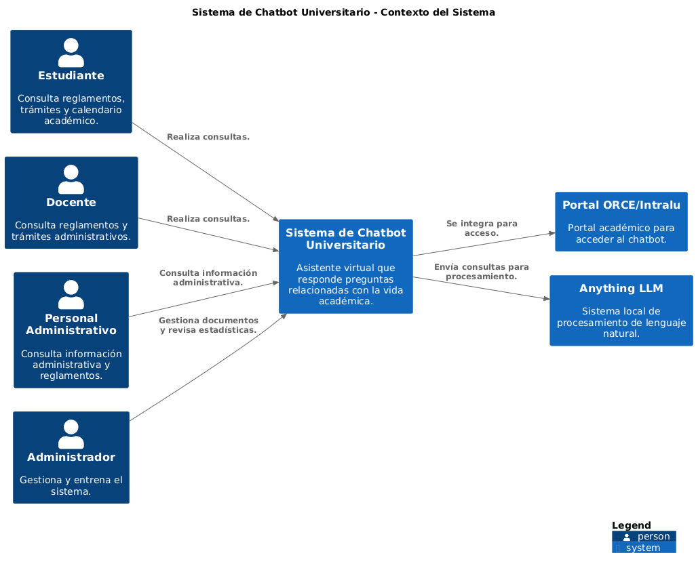
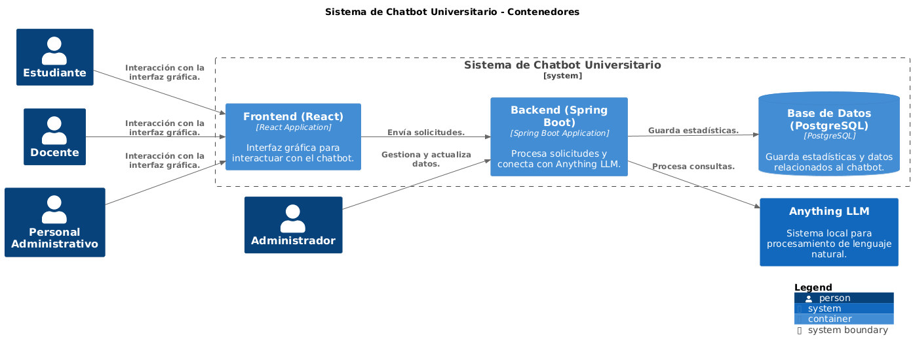
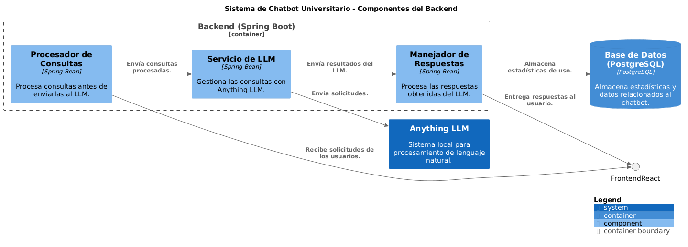
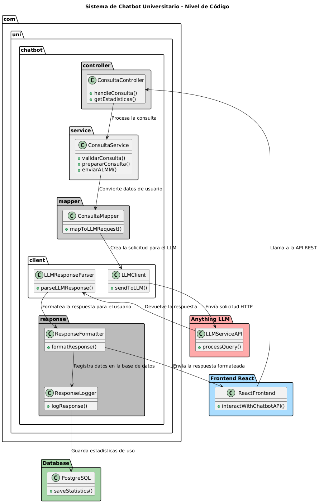

# **Diagramas C4 - Chatbot Universitario**

Este repositorio contiene los diagramas C4 que representan la arquitectura del **Sistema de Chatbot Universitario** desarrollado para la Universidad Nacional de Ingeniería (UNI). Estos diagramas describen desde el contexto general hasta la implementación a nivel de código del sistema, siguiendo el modelo C4.

---

## **Índice**
1. [¿Qué es C4?](#qué-es-c4)
2. [Estructura de los Diagramas](#estructura-de-los-diagramas)
3. [Herramientas Utilizadas](#herramientas-utilizadas)
4. [Diagrama de Niveles](#diagrama-de-niveles)
   - [Nivel C1: Contexto](#nivel-c1-contexto)
   - [Nivel C2: Contenedores](#nivel-c2-contenedores)
   - [Nivel C3: Componentes](#nivel-c3-componentes)
   - [Nivel C4: Código](#nivel-c4-código)
5. [Cómo Visualizar los Diagramas](#cómo-visualizar-los-diagramas)

---

## **¿Qué es C4?**
El modelo C4 (Context, Containers, Components, Code) es una técnica para crear diagramas de arquitectura de software. Este modelo permite visualizar el sistema desde diferentes niveles de abstracción, facilitando la comunicación entre los equipos técnicos y no técnicos.

- **C1**: Diagrama de Contexto (visión general del sistema y sus usuarios).
- **C2**: Diagrama de Contenedores (cómo interactúan los principales componentes del sistema).
- **C3**: Diagrama de Componentes (detalles internos de los contenedores principales).
- **C4**: Diagrama de Código (niveles más detallados, incluyendo clases y paquetes).

---

## **Estructura de los Diagramas**
- **`/diagramas`**: Carpeta principal con los archivos `.puml` y sus exportaciones.
  - **`C1_Context.puml`**: Diagrama de Contexto.
  - **`C2_Containers.puml`**: Diagrama de Contenedores.
  - **`C3_Components.puml`**: Diagrama de Componentes.
  - **`C4_Code.puml`**: Diagrama a nivel de Código.
- **`/exports`**: Imágenes generadas de los diagramas en formato PNG o SVG.

---

## **Herramientas Utilizadas**
1. **[PlantUML](https://plantuml.com/es)**: Lenguaje para la generación de diagramas UML y C4.
2. **VSCodium/VSCode**: Editor de texto con extensiones para PlantUML.
3. **Java JDK**: Requerido para ejecutar PlantUML.
4. **Graphviz**: Motor de renderizado necesario para PlantUML.

---

## **Diagrama de Niveles**

### **Nivel C1: Contexto**
Este nivel muestra cómo el sistema interactúa con sus usuarios y otros sistemas externos.



### **Nivel C2: Contenedores**
Aquí se representan los contenedores principales del sistema, como el **Frontend (React)**, el **Backend (Spring Boot)**, y la **API de Anything LLM**.



### **Nivel C3: Componentes**
Detalla los componentes clave dentro del contenedor del backend, incluyendo servicios, procesadores de consultas y manejadores de respuestas.



### **Nivel C4: Código**
Describe el diseño a nivel de clases y paquetes, especificando cómo interactúan las clases en el backend.



---

## **Cómo Visualizar los Diagramas**

1. **Generar los Diagramas Localmente**
   - Instala [PlantUML](https://plantuml.com/es) y [Graphviz](https://graphviz.gitlab.io/).
   - Usa el siguiente comando en tu terminal para renderizar un diagrama:
     ```bash
     plantuml diagrams/C1_Context.puml
     ```
   - Los archivos generados estarán en la misma carpeta que el `.puml`.

2. **Visualizar en un IDE**
   - Instala la extensión **PlantUML** en VSCode o VSCodium.
   - Abre cualquier archivo `.puml` y renderízalo directamente en el editor.

3. **Usar un Visualizador en Línea**
   - Sube tus archivos `.puml` en herramientas como [PlantUML Online Editor](https://www.plantuml.com/plantuml/uml/).

---
